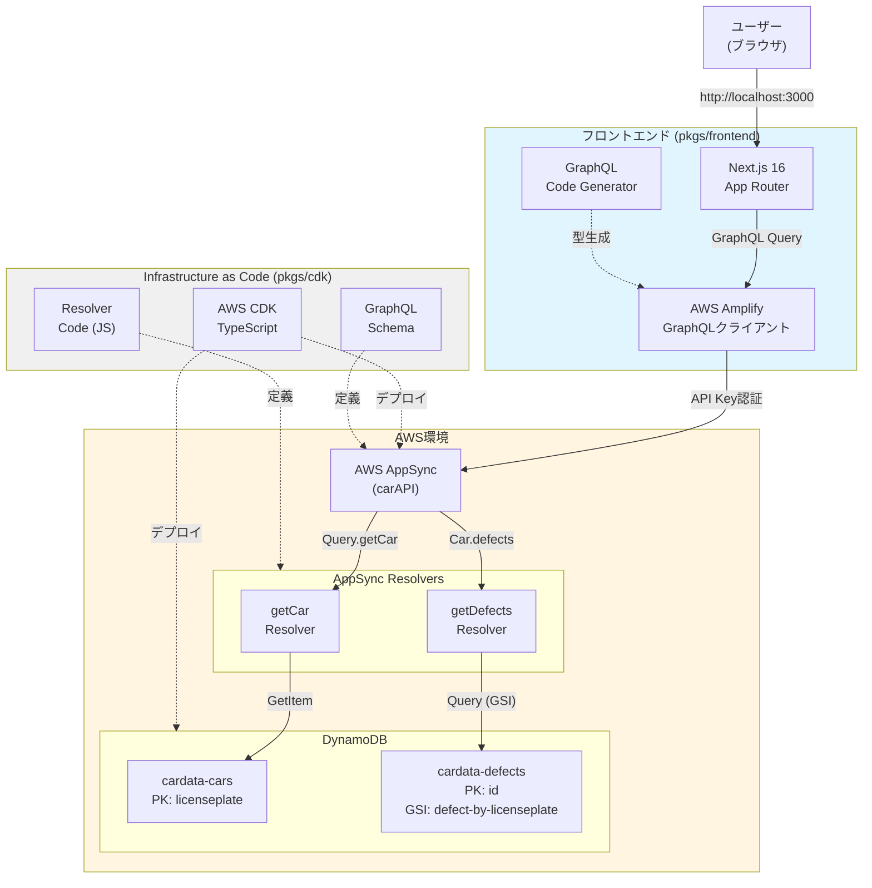
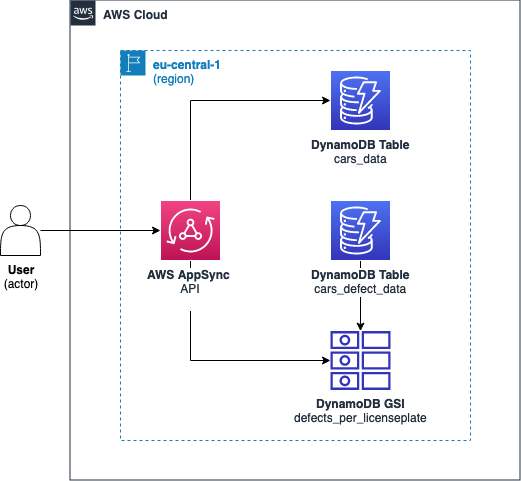
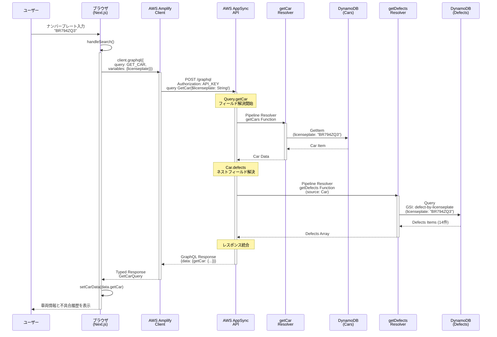
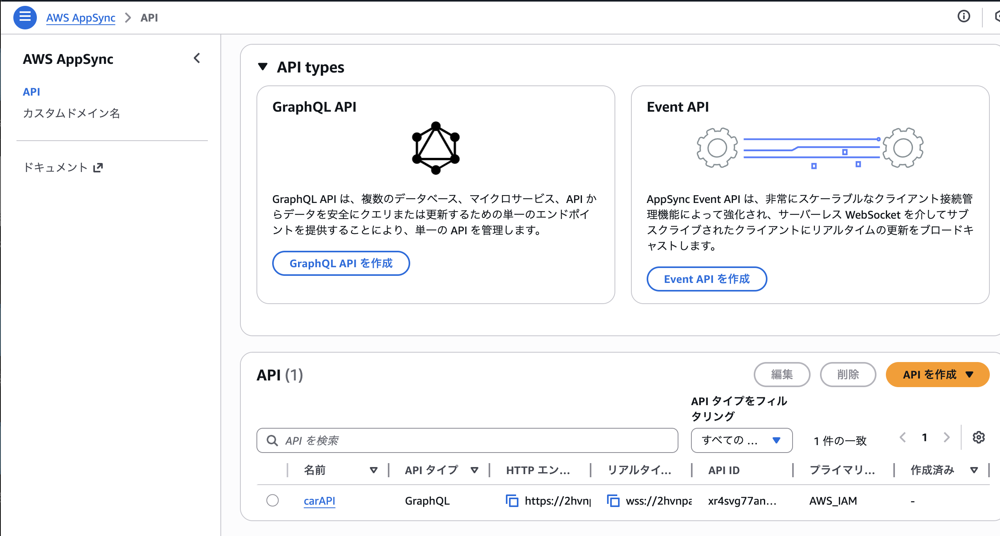
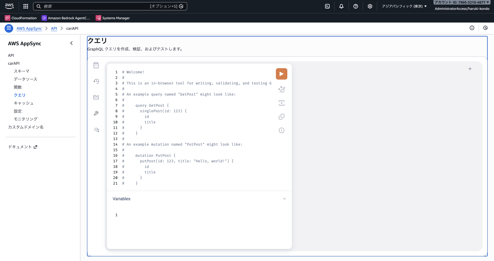
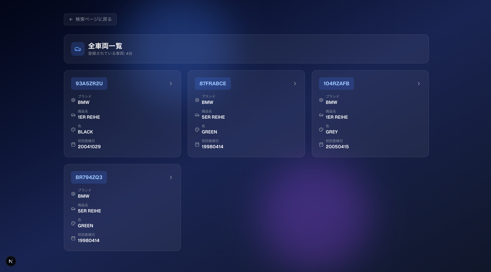
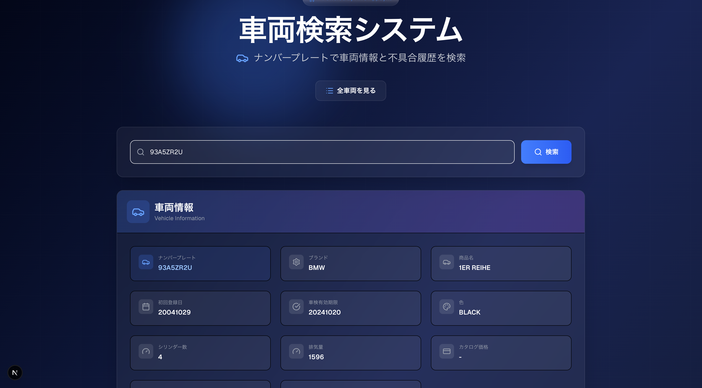
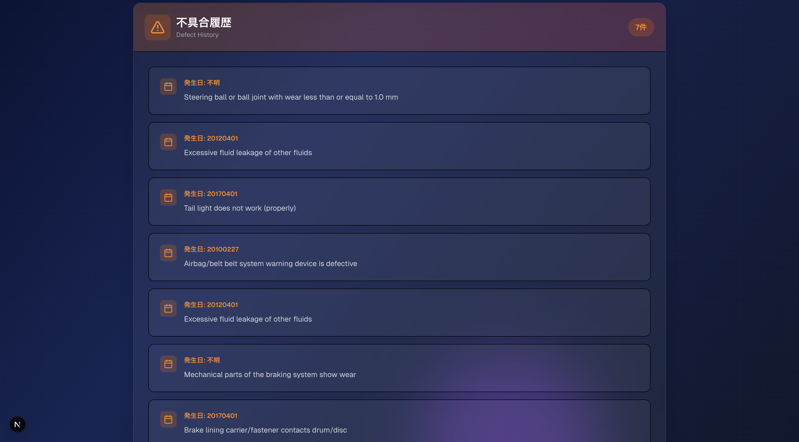

# AWS AppSync + DynamoDB + Next.js フルスタックデモ

このプロジェクトは、**モノレポ構成**で構築されたフルスタックアプリケーションです。AWS CDKを使用してインフラストラクチャをコード化し、DynamoDBテーブルをバックエンドに持つAWS AppSync GraphQL APIを構築し、Next.jsフロントエンドから利用する完全なシステムを示しています。

特に、車（Cars）と不具合（Defects）という2つのテーブル間で**1対多のリレーションシップ**を確立し、**ネストされたGraphQLクエリ**を実現する方法を示しています。

## 概要

このプロジェクトは以下のコンポーネントで構成されています：

### バックエンド (pkgs/cdk)

AWS CDKで構築されたインフラストラクチャ：

- **GraphQL API**: `carAPI` という名前のAWS AppSync API
- **DynamoDBテーブル**:
  - `cardata-cars`: 車の基本情報を格納
  - `cardata-defects`: 車に関連する不具合情報を格納（GSI付き）
- **リゾルバー**: パイプラインリゾルバーによる効率的なデータ取得

### フロントエンド (pkgs/frontend)

Next.js 16 (App Router) で構築されたWebアプリケーション：

- **AWS Amplify**: GraphQLクライアントとしてAppSync APIと通信
- **型安全性**: GraphQL Code Generatorによる自動型生成
- **レスポンシブUI**: Tailwind CSS v4によるモダンなデザイン

### 主要機能

これらを連携させることで、以下の機能を実現しています：

- ナンバープレートで車両情報を検索
- 車両に関連するすべての不具合履歴を一度のクエリで取得
- リアルタイムなデータ表示と型安全なフロントエンド実装

データはオランダのRDW（車両登録局）の公開データに基づいています。

## 提供している機能

*   **車情報の取得**: ナンバープレートを指定して車の詳細情報を取得。
*   **不具合情報の取得**: 車情報に紐付く不具合情報のリストを取得（ネストされたクエリ）。
*   **データ投入ツール**: サンプルデータをDynamoDBに一括投入するユーティリティ。

## プロジェクト構造

このプロジェクトはpnpmを使用したモノレポ構成で、以下のパッケージで構成されています：

```
AppSyncSample-2/
├── pkgs/
│   ├── cdk/                    # AWS CDKインフラストラクチャコード
│   │   ├── lib/                # CDKスタック定義
│   │   ├── bin/                # CDKエントリーポイント
│   │   ├── graphql/            # GraphQLスキーマ定義
│   │   ├── resolvers/          # AppSyncリゾルバー (JavaScript)
│   │   ├── utils/              # データ投入ユーティリティ
│   │   ├── test/               # ユニットテスト
│   │   ├── jest.config.js      # Jestテスト設定
│   │   └── package.json
│   └── frontend/               # Next.jsフロントエンド
│       ├── app/                # Next.js App Router
│       ├── lib/                # GraphQLクライアント設定・型定義
│       └── package.json
├── package.json                # ルートパッケージ設定
└── pnpm-workspace.yaml         # pnpmワークスペース設定
```

## システム構成図





## 処理シーケンス図

**`getCar` クエリ実行時のフロー (フロントエンドからバックエンドまで)**



## 技術スタック

**バックエンド:**
*   **Infrastructure as Code**: AWS CDK (TypeScript)
*   **API**: AWS AppSync (GraphQL)
*   **Database**: Amazon DynamoDB
*   **Runtime**: Node.js (v18.x recommended)
*   **認証**: API Key + IAM

**フロントエンド:**
*   **フレームワーク**: Next.js 16 (App Router)
*   **UI**: React 19 + Tailwind CSS v4
*   **GraphQLクライアント**: AWS Amplify
*   **型生成**: GraphQL Code Generator
*   **言語**: TypeScript

**共通:**
*   **Package Manager**: pnpm (モノレポ管理)
*   **Linter / Formatter**: Biome
*   **Testing**: Jest

## GraphQL APIの詳細解説

### スキーマ定義

このプロジェクトのGraphQLスキーマは `pkgs/cdk/graphql/schema.graphql` に定義されています：

```graphql
# 車の情報を表す型
type Car {
  licenseplate: String!
  brand: String!
  tradename: String
  expirydateapk: String
  firstcolor: String!
  cylindercount: String
  cylindervolume: String
  firstregistrationdate: String
  catalogprice: String
  length: String
  width: String
  # 車に関連する不具合のリスト (ネストされたフィールド)
  defects: [Defect]
}

# 不具合情報を表す型
type Defect {
  licenseplate: String!
  defectstartdate: String
  defectdescription: String
}

type Query {
  # ナンバープレートで車を検索するクエリ
  getCar(licenseplate: String!): Car
}
```

### AWS AppSyncのリゾルバーとは

**リゾルバー**は、GraphQLのクエリやミューテーションがどのようにデータを取得・操作するかを定義するコンポーネントです。

AppSyncにおけるリゾルバーは、GraphQLスキーマのフィールドとデータソース（DynamoDB、Lambda、HTTPエンドポイントなど）を接続する橋渡しの役割を果たします。

#### リゾルバーの種類

AppSyncには2種類のリゾルバーがあります：

1. **ユニットリゾルバー (Unit Resolver)**
   - 単一のデータソースに対して、1つの操作のみを実行
   - シンプルなデータ取得に適している
   - 例：1つのテーブルから1件のアイテムを取得

2. **パイプラインリゾルバー (Pipeline Resolver)** ⭐ このプロジェクトで使用
   - 複数のAppSync関数を順番に実行できる
   - 各関数は異なるデータソースにアクセス可能
   - 複雑なビジネスロジックやデータ結合に適している

#### パイプラインリゾルバーのメリット

このプロジェクトでパイプラインリゾルバーを採用している理由：

✅ **モジュール性**: 各AppSync関数を独立したロジックとして定義でき、再利用が容易  
✅ **柔軟性**: 複数のデータソースを組み合わせたり、条件分岐を実装できる  
✅ **保守性**: 処理ステップが明確に分離されているため、デバッグや修正が容易  
✅ **拡張性**: 新しい処理ステップを追加する際、既存の関数を変更せずに済む  

#### このプロジェクトでの実装パターン

```
GraphQLクエリ: getCar(licenseplate: "BR794ZQ3")
    ↓
[パイプラインリゾルバー: PipelineResolverGetCars]
    ↓
[AppSync関数: getCars] → DynamoDB (cardata-cars) から車情報を取得
    ↓
結果を返す → { licenseplate, brand, tradename, ... }
    ↓
[ネストされたフィールド: defects]
    ↓
[パイプラインリゾルバー: PipelineResolverGetDefects]
    ↓
[AppSync関数: getDefects] → DynamoDB (cardata-defects/GSI) から不具合情報を取得
    ↓
最終結果: Car オブジェクト + 関連する Defects 配列
```

**ポイント**:
- `Query.getCar` は車の基本情報を取得
- `Car.defects` フィールドは、親の `Car` オブジェクトから `licenseplate` を受け取り、関連する不具合を自動的に取得
- クライアントは1回のGraphQLクエリで、車と不具合の両方を取得できる（N+1問題を回避）

### リゾルバーアーキテクチャの詳細

このプロジェクトでは**パイプラインリゾルバー**を使用して、効率的なデータ取得を実現しています。

#### 1. Query.getCar リゾルバー

**ファイル**: `pkgs/cdk/resolvers/getCar.js`

```javascript
export function request(ctx) {
  return {
    operation: "GetItem",
    key: util.dynamodb.toMapValues({
      licenseplate: ctx.args.licenseplate
    }),
  };
}

export function response(ctx) {
  return ctx.result;
}
```

**動作**:
- DynamoDBの `cardata-cars` テーブルから、指定されたナンバープレートに一致する車の情報を取得
- `GetItem` オペレーションでプライマリキー (licenseplate) による高速な検索を実行

#### 2. Car.defects リゾルバー (ネストされたフィールド)

**ファイル**: `pkgs/cdk/resolvers/getDefects.js`

```javascript
export function request(ctx) {
  const limit = 20;
  const query = JSON.parse(
    util.transform.toDynamoDBConditionExpression({
      licenseplate: { eq: ctx.source.licenseplate },
    }),
  );

  return {
    operation: "Query",
    index: "defect-by-licenseplate",
    query,
    limit
  };
}

export function response(ctx) {
  if (ctx.error) {
    util.error(ctx.error.message, ctx.error.type);
  }
  return ctx.result.items;
}
```

**動作**:
- `ctx.source.licenseplate` により、親の `Car` オブジェクトからナンバープレートを取得
- DynamoDBの `cardata-defects` テーブルのGSI (`defect-by-licenseplate`) をクエリ
- 最大20件の不具合情報を取得

#### 3. パイプラインリゾルバーの仕組み

**ファイル**: `pkgs/cdk/resolvers/pipeline.js`

```javascript
export function request(_ctx) {
  return {};
}

export function response(ctx) {
  return ctx.prev.result;
}
```

**動作**:
- パイプラインリゾルバーは、複数のAppSync関数を順番に実行
- `request`: 空のオブジェクトを返し、前の関数の結果をそのまま渡す
- `response`: 前の関数 (`ctx.prev.result`) の結果を返す

このプロジェクトでは、各パイプラインリゾルバーは**1つのAppSync関数のみ**を含むシンプルな構成ですが、必要に応じて複数の関数を連鎖させることも可能です。

#### 4. CDKでのパイプラインリゾルバー定義

**ファイル**: `pkgs/cdk/lib/cdk-appsync-demo-stack.ts`

```typescript
// AppSync関数の定義
const carsResolver = new AppsyncFunction(this, "CarsFunction", {
  name: "getCars",
  api,
  dataSource: carsDataSource,
  code: Code.fromAsset(path.join(__dirname, "../resolvers/getCar.js")),
  runtime: FunctionRuntime.JS_1_0_0,
});

// パイプラインリゾルバーの定義
new Resolver(this, "PipelineResolverGetCars", {
  api,
  typeName: "Query",           // GraphQLスキーマの型名
  fieldName: "getCar",          // GraphQLスキーマのフィールド名
  runtime: FunctionRuntime.JS_1_0_0,
  code: Code.fromAsset(path.join(__dirname, "../resolvers/pipeline.js")),
  pipelineConfig: [carsResolver], // 実行する関数のリスト
});
```

**構成要素**:
- **AppsyncFunction**: 実際のデータソース操作を行う関数（getCars, getDefects）
- **Resolver**: GraphQLフィールドとAppSync関数を接続するパイプライン定義
- **pipelineConfig**: 実行する関数の配列（この例では1つだけだが、複数指定可能）

**実行フロー**:
```
GraphQLクエリ → Resolver (pipeline.js)
                    ↓
                 [request関数] → {}を返す
                    ↓
                 AppsyncFunction (getCar.js)
                    ↓
                 [request関数] → DynamoDBへのGetItemリクエスト生成
                    ↓
                 DynamoDB実行
                    ↓
                 [response関数] → 結果を返す
                    ↓
                 Resolver (pipeline.js)
                    ↓
                 [response関数] → ctx.prev.result を返す
                    ↓
                 クライアントへ結果を返却
```

### DynamoDB テーブル設計

#### Cars テーブル (cardata-cars)

| 項目 | 値 |
|------|-----|
| **パーティションキー** | `licenseplate` (String) |
| **用途** | 車両の基本情報を格納 |
| **アクセスパターン** | GetItem (ナンバープレートによる直接検索) |

#### Defects テーブル (cardata-defects)

| 項目 | 値 |
|------|-----|
| **パーティションキー** | `id` (String) |
| **GSI名** | `defect-by-licenseplate` |
| **GSIパーティションキー** | `licenseplate` (String) |
| **用途** | 車両に関連する不具合情報を格納 |
| **アクセスパターン** | Query (GSI経由でナンバープレートによる検索) |

**GSI (Global Secondary Index) の利点**:
- プライマリキーとは異なる属性 (licenseplate) でクエリが可能
- 1対多のリレーションシップを効率的に実現
- 特定の車両に関連するすべての不具合を高速に取得

### 認証方式

このAPIは2つの認証方式をサポートしています：

1. **API Key認証** (デフォルト)
   - フロントエンドからのアクセスに使用
   - 開発・テスト環境向け

2. **IAM認証** (追加モード)
   - AWS内部サービスからのアクセスに使用
   - よりセキュアな環境向け

### フロントエンドからの利用

#### GraphQL Code Generatorによる型安全性

`pkgs/frontend/codegen.ts` の設定により、GraphQLスキーマから自動的にTypeScript型が生成されます：

```typescript
// 自動生成される型定義の例
export type GetCarQuery = {
  __typename?: 'Query';
  getCar?: {
    __typename?: 'Car';
    licenseplate: string;
    brand: string;
    tradename?: string | null;
    defects?: Array<{
      __typename?: 'Defect';
      licenseplate: string;
      defectdescription?: string | null;
      defectstartdate?: string | null;
    } | null> | null;
  } | null;
};
```

#### クエリの実行

`pkgs/frontend/app/components/CarSearch.tsx` でのGraphQLクエリ実行例：

```typescript
const result = await client.graphql({
  query: GET_CAR,
  variables: { licenseplate: licenseplate.trim() },
});

const data = (result as any).data as GetCarQuery;
if (data?.getCar) {
  setCarData(data.getCar); // 型安全なデータ
}
```

**利点**:
- コンパイル時の型チェックによりバグを早期に発見
- IDEの自動補完によって開発効率が向上
- スキーマ変更時の影響範囲が明確

## 動かし方

### 前提条件

*   Node.js (v18.x以上)
*   pnpm (`npm install -g pnpm`)
*   AWS CLI (設定済みであること)
*   AWS CDK (`npm install -g aws-cdk`)

### インストール

```bash
git clone <repository-url>
cd AppSyncSample-2
pnpm install
```

### ビルドとチェック

```bash
# フロントエンドのビルド
pnpm frontend run build

# CDKのビルド
pnpm cdk run build

# フォーマットの自動修正 (全体)
pnpm run format

# Lintチェック (個別)
pnpm frontend run lint
```

### テスト

#### CDKスタックのユニットテスト

CDKインフラストラクチャの正確性を検証するための包括的なユニットテストが実装されています。

```bash
# CDKのテストを実行
pnpm --filter cdk test

# または、pkgs/cdkディレクトリから
cd pkgs/cdk
pnpm test

# カバレッジレポート付きでテストを実行
pnpm test -- --coverage
```

**テスト内容**:
- ✅ **DynamoDBテーブル**: Cars/Defectsテーブルの作成と設定
- ✅ **グローバルセカンダリインデックス (GSI)**: defect-by-licenseplateの設定
- ✅ **AppSync GraphQL API**: API作成、認証設定、スキーマ定義
- ✅ **データソース**: DynamoDBデータソースの接続
- ✅ **AppSync関数**: getCars/getDefects関数の設定
- ✅ **パイプラインリゾルバー**: Query.getCar/Car.defectsリゾルバー
- ✅ **IAMロールとポリシー**: 適切な権限設定
- ✅ **CloudFormation出力**: API URL、API Key、テーブル名の出力
- ✅ **スナップショットテスト**: スタック全体の構成変更検出

テストフレームワーク: **Jest** + **AWS CDK Assertions**  
テストファイル: `pkgs/cdk/test/cdk-appsync-demo-stack.test.ts`

### デプロイ

AWS環境へデプロイします。

```bash
# ルートディレクトリから
pnpm cdk run deploy

# または、pkgs/cdkディレクトリから
cd pkgs/cdk
pnpm deploy
```

デプロイ完了後、以下の出力値をメモしてください（フロントエンド設定で使用します）：
- `GraphQLAPIURL`: AppSync APIのエンドポイント
- `GraphQLAPIKey`: API Key
- `CarsTableName`: 車両テーブル名
- `DefectsTableName`: 不具合テーブル名

### データ投入

デプロイ完了後、サンプルデータをDynamoDBに投入します。

```bash
# 環境変数を設定 (リージョンを指定)
export CDK_DEFAULT_REGION=ap-northeast-1

# ルートディレクトリから
pnpm cdk run push-data

# または、pkgs/cdkディレクトリから
cd pkgs/cdk
pnpm push-data
```

### フロントエンド設定と起動

1. 環境変数を設定:

```bash
cd pkgs/frontend
cp .env.local.example .env.local
```

2. `.env.local` ファイルを編集し、デプロイ時に出力された値を設定:
   - `NEXT_PUBLIC_APPSYNC_ENDPOINT`: GraphQLAPIURL の値
   - `NEXT_PUBLIC_APPSYNC_API_KEY`: GraphQLAPIKey の値

3. GraphQL型定義を生成 (frontendディレクトリから):

```bash
cd pkgs/frontend
pnpm codegen
```

または、ルートディレクトリから:

```bash
pnpm frontend run codegen
```

4. フロントエンド起動 (frontendディレクトリから、または下記コマンド):

```bash
pnpm frontend run dev
```

ブラウザで [http://localhost:3000](http://localhost:3000) にアクセス

### 動作確認

AWSマネジメントコンソールのAppSyncクエリエディタ、または任意のGraphQLクライアントから以下のクエリを実行します。

```graphql
query GetCar {
  getCar(licenseplate: "BR794ZQ3") {
    expirydateapk
    cylindervolume
    catalogprice
    defects {
      defectdescription
      defectstartdate
      licenseplate
    }
    firstcolor
    firstregistrationdate
    licenseplate
  }
}
```

取得結果

```json
{
  "data": {
    "getCar": {
      "expirydateapk": "20231019",
      "cylindervolume": null,
      "catalogprice": null,
      "defects": [
        {
          "defectdescription": "Anti-lock braking system warning device indicates defect",
          "defectstartdate": "20180520",
          "licenseplate": "BR794ZQ3"
        },
        {
          "defectdescription": "Tail light does not work (properly)",
          "defectstartdate": "20170401",
          "licenseplate": "BR794ZQ3"
        },
        {
          "defectdescription": "Excessive fluid leakage of other fluids",
          "defectstartdate": "20120401",
          "licenseplate": "BR794ZQ3"
        },
        {
          "defectdescription": "Tire damaged",
          "defectstartdate": "20170401",
          "licenseplate": "BR794ZQ3"
        },
        {
          "defectdescription": "Airbag/belt belt system warning device is defective",
          "defectstartdate": "20100227",
          "licenseplate": "BR794ZQ3"
        },
        {
          "defectdescription": "Airbag/belt belt system warning device is defective",
          "defectstartdate": "20100227",
          "licenseplate": "BR794ZQ3"
        },
        {
          "defectdescription": "Anti-lock braking system warning device indicates defect",
          "defectstartdate": "20180520",
          "licenseplate": "BR794ZQ3"
        },
        {
          "defectdescription": "Anti-lock braking system warning device indicates defect",
          "defectstartdate": "20180520",
          "licenseplate": "BR794ZQ3"
        },
        {
          "defectdescription": "Mechanical parts of the braking system show wear",
          "defectstartdate": null,
          "licenseplate": "BR794ZQ3"
        },
        {
          "defectdescription": "Anti-lock braking system warning device indicates defect",
          "defectstartdate": "20180520",
          "licenseplate": "BR794ZQ3"
        },
        {
          "defectdescription": "Airbag/belt belt system warning device is defective",
          "defectstartdate": "20100227",
          "licenseplate": "BR794ZQ3"
        },
        {
          "defectdescription": "Battery incorrectly attached",
          "defectstartdate": "20170401",
          "licenseplate": "BR794ZQ3"
        },
        {
          "defectdescription": "Airbag/belt belt system warning device is defective",
          "defectstartdate": "20100227",
          "licenseplate": "BR794ZQ3"
        },
        {
          "defectdescription": "Door cannot be opened normally",
          "defectstartdate": "20170401",
          "licenseplate": "BR794ZQ3"
        }
      ],
      "firstcolor": "GREEN",
      "firstregistrationdate": "19980414",
      "licenseplate": "BR794ZQ3"
    }
  }
}
```

### クリーンアップ

リソースを削除する場合：

```bash
# ルートディレクトリから
pnpm cdk run destroy

# または、pkgs/cdkディレクトリから
cd pkgs/cdk
pnpm destroy
```

## コストについて

このアーキテクチャの運用コストは、月額数ドル程度（eu-central-1リージョンに基づく）と見積もられます。`pnpm run push-data` コマンドの実行後、DynamoDBテーブルとインデックスの書き込み容量を低い設定に調整することで、コストを最適化できます。

## スクショ









