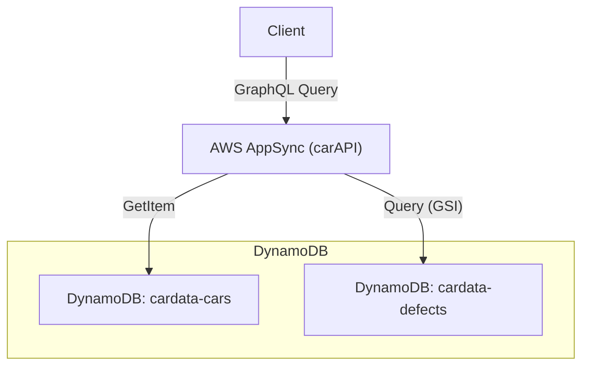
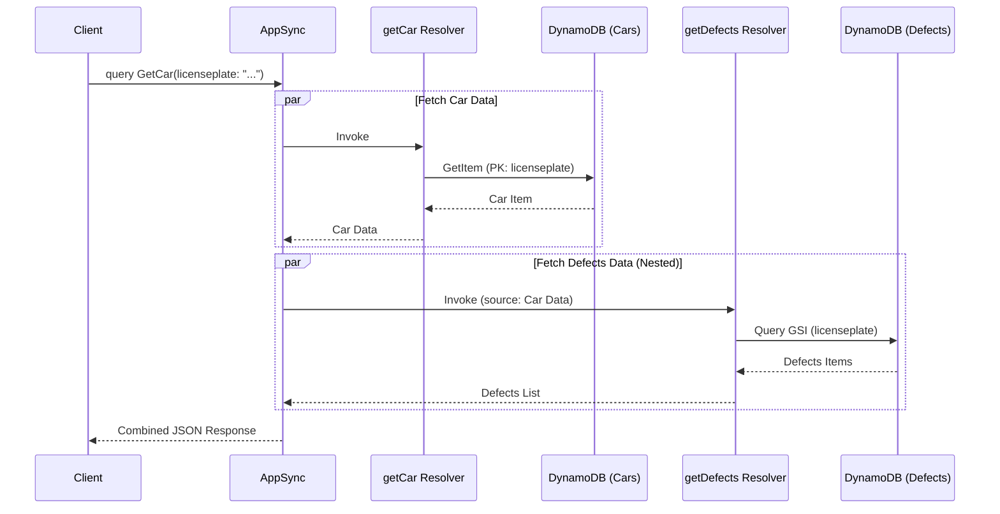

# AWS CDK AppSync DynamoDB Table Joining Demo

このプロジェクトは、AWS CDKを使用して、DynamoDBテーブルをバックエンドに持つAWS AppSync APIを構築するデモです。
特に、車（Cars）と不具合（Defects）という2つのテーブル間で1対多のリレーションシップを確立し、ネストされたクエリを実現する方法を示しています。

## 概要

このプロジェクトでは、`carAPI` というAppSync APIと、以下の2つのDynamoDBテーブルを作成します。

*   `cardata-cars`: 車の情報を格納
*   `cardata-defects`: 車に関連する不具合情報を格納

これらを連携させることで、特定の車の情報とその車に関連する不具合一覧を一度のGraphQLクエリで取得できます。
データはオランダのRDW（車両登録局）の公開データに基づいています。

## 提供している機能

*   **車情報の取得**: ナンバープレートを指定して車の詳細情報を取得。
*   **不具合情報の取得**: 車情報に紐付く不具合情報のリストを取得（ネストされたクエリ）。
*   **データ投入ツール**: サンプルデータをDynamoDBに一括投入するユーティリティ。

## システム構成図




## 処理シーケンス図

**`getCar` クエリ実行時のフロー**



## 技術スタック

**バックエンド:**
*   **Infrastructure as Code**: AWS CDK (TypeScript)
*   **API**: AWS AppSync (GraphQL)
*   **Database**: Amazon DynamoDB
*   **Runtime**: Node.js (v18.x recommended)
*   **認証**: API Key + IAM

**フロントエンド:**
*   **フレームワーク**: Next.js 16 (App Router)
*   **UI**: React 19 + Tailwind CSS v4
*   **GraphQLクライアント**: AWS Amplify
*   **型生成**: GraphQL Code Generator
*   **言語**: TypeScript

**共通:**
*   **Package Manager**: pnpm (モノレポ管理)
*   **Linter / Formatter**: Biome
*   **Testing**: Jest

## 動かし方

### 前提条件

*   Node.js (v18.x以上)
*   pnpm (`npm install -g pnpm`)
*   AWS CLI (設定済みであること)
*   AWS CDK (`npm install -g aws-cdk`)

### インストール

```bash
git clone <repository-url>
cd AppSyncSample-2
pnpm install
```

### ビルドとチェック

```bash
# TypeScriptのビルド
pnpm frontend run build
pnpm cdk run build

# フォーマットの自動修正
pnpm run format
```

### デプロイ

AWS環境へデプロイします。

```bash
pnpm cdk run deploy '*'
```

### データ投入

デプロイ完了後、サンプルデータをDynamoDBに投入します。

```bash
export CDK_DEFAULT_REGION=ap-northeast-1 
pnpm run push-data
```

### フロントエンド設定と起動

1. 環境変数を設定:

```bash
cd pkgs/frontend
cp .env.local.example .env.local
```

2. `.env.local` ファイルを編集し、デプロイ時に出力された値を設定:
   - `NEXT_PUBLIC_APPSYNC_ENDPOINT`: GraphQLAPIURL の値
   - `NEXT_PUBLIC_APPSYNC_API_KEY`: GraphQLAPIKey の値

3. GraphQL型定義を生成:

```bash
pnpm codegen
```

4. フロントエンド起動:

```bash
pnpm frontend run dev
```

ブラウザで [http://localhost:3000](http://localhost:3000) にアクセス

### 動作確認

AWSマネジメントコンソールのAppSyncクエリエディタ、または任意のGraphQLクライアントから以下のクエリを実行します。

```graphql
query GetCar {
  getCar(licenseplate: "BR794ZQ3") {
    expirydateapk
    cylindervolume
    catalogprice
    defects {
      defectdescription
      defectstartdate
      licenseplate
    }
    firstcolor
    firstregistrationdate
    licenseplate
  }
}
```

取得結果

```json
{
  "data": {
    "getCar": {
      "expirydateapk": "20231019",
      "cylindervolume": null,
      "catalogprice": null,
      "defects": [
        {
          "defectdescription": "Anti-lock braking system warning device indicates defect",
          "defectstartdate": "20180520",
          "licenseplate": "BR794ZQ3"
        },
        {
          "defectdescription": "Tail light does not work (properly)",
          "defectstartdate": "20170401",
          "licenseplate": "BR794ZQ3"
        },
        {
          "defectdescription": "Excessive fluid leakage of other fluids",
          "defectstartdate": "20120401",
          "licenseplate": "BR794ZQ3"
        },
        {
          "defectdescription": "Tire damaged",
          "defectstartdate": "20170401",
          "licenseplate": "BR794ZQ3"
        },
        {
          "defectdescription": "Airbag/belt belt system warning device is defective",
          "defectstartdate": "20100227",
          "licenseplate": "BR794ZQ3"
        },
        {
          "defectdescription": "Airbag/belt belt system warning device is defective",
          "defectstartdate": "20100227",
          "licenseplate": "BR794ZQ3"
        },
        {
          "defectdescription": "Anti-lock braking system warning device indicates defect",
          "defectstartdate": "20180520",
          "licenseplate": "BR794ZQ3"
        },
        {
          "defectdescription": "Anti-lock braking system warning device indicates defect",
          "defectstartdate": "20180520",
          "licenseplate": "BR794ZQ3"
        },
        {
          "defectdescription": "Mechanical parts of the braking system show wear",
          "defectstartdate": null,
          "licenseplate": "BR794ZQ3"
        },
        {
          "defectdescription": "Anti-lock braking system warning device indicates defect",
          "defectstartdate": "20180520",
          "licenseplate": "BR794ZQ3"
        },
        {
          "defectdescription": "Airbag/belt belt system warning device is defective",
          "defectstartdate": "20100227",
          "licenseplate": "BR794ZQ3"
        },
        {
          "defectdescription": "Battery incorrectly attached",
          "defectstartdate": "20170401",
          "licenseplate": "BR794ZQ3"
        },
        {
          "defectdescription": "Airbag/belt belt system warning device is defective",
          "defectstartdate": "20100227",
          "licenseplate": "BR794ZQ3"
        },
        {
          "defectdescription": "Door cannot be opened normally",
          "defectstartdate": "20170401",
          "licenseplate": "BR794ZQ3"
        }
      ],
      "firstcolor": "GREEN",
      "firstregistrationdate": "19980414",
      "licenseplate": "BR794ZQ3"
    }
  }
}
```

### クリーンアップ

リソースを削除する場合：

```bash
cdk destroy
```

## コストについて

このアーキテクチャの運用コストは、月額数ドル程度（eu-central-1リージョンに基づく）と見積もられます。`pnpm run push-data` コマンドの実行後、DynamoDBテーブルとインデックスの書き込み容量を低い設定に調整することで、コストを最適化できます。

## スクショ


