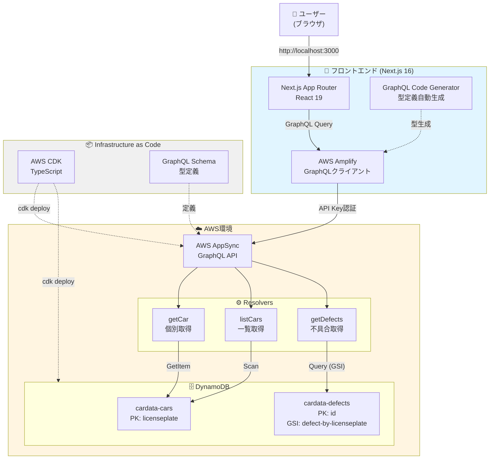
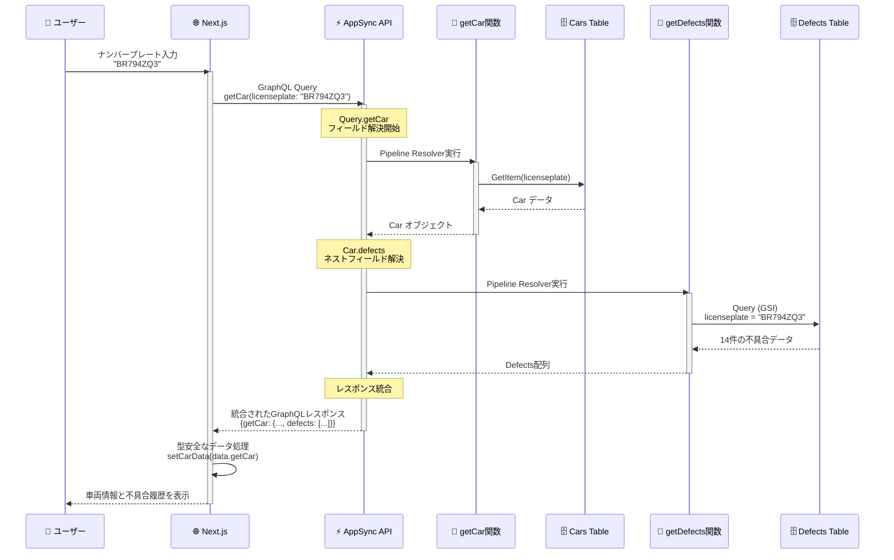
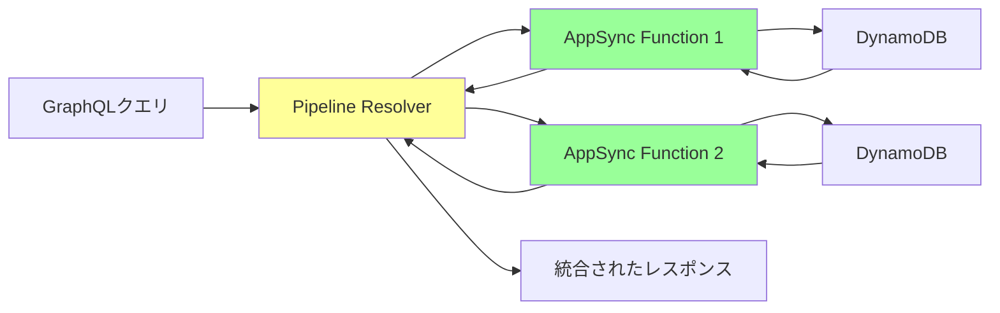

# AWS AppSync + DynamoDB + Next.jsで作る、モダンな車両管理システム【GraphQL完全理解への道】

## 🎯 この記事で学べること

- AWS AppSyncによるサーバーレスGraphQL APIの構築
- DynamoDBの1対多リレーションシップの実装
- パイプラインリゾルバーによる効率的なデータ取得
- Next.js 16 + React 19による最新フロントエンド開発
- GraphQL Code Generatorによる型安全な開発
- グラスモーフィズムを活用したモダンUI設計

## はじめに

こんにちは！今回は、**AWS AppSync**、**DynamoDB**、**Next.js**を使って、実践的な車両管理システムを構築した経験を共有します。

GraphQLは聞いたことあるけど、実際にプロダクションレベルで使ったことがない...という方も多いのではないでしょうか？私もその一人でした。そこで、実際に手を動かしながらGraphQLの真の価値を理解するため、このプロジェクトを作成しました。

### なぜこのプロジェクトを作ったのか

- **GraphQLの実践的な理解**: 書籍やチュートリアルだけでは掴めない、リレーションシップやN+1問題への対処
- **AWS AppSyncの探求**: マネージドGraphQLサービスの真価を体験
- **型安全なフルスタック開発**: スキーマ駆動開発による開発体験の向上
- **モダンなUI/UX**: 最新のデザイントレンドを実装

## 📱 完成したアプリケーション

まずは完成形をご覧ください！

### トップページ - 車両検索


**主な機能**:
- グラスモーフィズムデザインによる洗練されたUI
- アニメーション効果で直感的な操作感
- ライセンスプレート検索による即座の情報表示

### 車両詳細表示


**特徴**:
- 1回のGraphQLクエリで車両情報と不具合履歴を同時取得
- カード型レイアウトで情報を整理
- アイコンによる視覚的な情報伝達

### 全車両一覧ページ


**実装ポイント**:
- ページネーション対応で大量データに対応
- グリッドレイアウトによる見やすい表示
- 各カードから詳細検索へのシームレスな遷移

### データ詳細とエラーハンドリング


## 🏗️ システムアーキテクチャ

### 全体構成図



**セキュリティに関する注釈**:
本デモでは簡易的な実装として **API Key** 認証を採用していますが、AppSyncは **AWS IAM** や **Amazon Cognito** との統合もサポートしています。実際のプロダクション環境でユーザーごとの細かいアクセス制御が必要な場合は、Cognito User Poolsの使用を推奨します。

### データフロー図

1回のGraphQLクエリで車両情報と不具合履歴を取得する様子をシーケンス図で表現します。



**ポイント**: 
- クライアントは**1回のリクエスト**で全データを取得（ネットワークオーバーヘッドの最小化）
- クライアントサイドでのN+1問題を解消
- ネストされたフィールドをAppSyncが自動的に解決

## 💻 技術スタック

### バックエンド
| 技術 | バージョン | 用途 |
|------|-----------|------|
| AWS CDK | Latest | IaCによるインフラ管理 |
| AWS AppSync | - | マネージドGraphQL API |
| DynamoDB | - | NoSQLデータベース |
| TypeScript | 5.x | 型安全なインフラコード |
| JavaScript | ES2020 | AppSyncリゾルバー |

### フロントエンド
| 技術 | バージョン | 用途 |
|------|-----------|------|
| Next.js | 16.x | React フレームワーク |
| React | 19.x | UIライブラリ |
| Tailwind CSS | 4.x | スタイリング |
| TypeScript | 5.x | 型安全な開発 |
| AWS Amplify | Latest | GraphQLクライアント |
| GraphQL Codegen | Latest | 型定義自動生成 |
| lucide-react | 0.562.0 | アイコンライブラリ |

### 開発ツール
- **pnpm**: モノレポ管理
- **Biome**: 高速なLinter/Formatter
- **Jest**: ユニットテスト

## 🎨 モダンUIデザインシステム

### デザインコンセプト

このプロジェクトでは、**グラスモーフィズム（Glassmorphism）**を採用しました。

```css
/* グラスモーフィズムの実装 */
.glass {
  background: rgba(255, 255, 255, 0.05);
  backdrop-filter: blur(10px);
  border: 1px solid rgba(255, 255, 255, 0.1);
}
```

### カラーパレット

- **Background**: Gradient (slate-950 → blue-950 → slate-900)
- **Primary**: Blue-500 to Blue-600
- **Accent**: Purple/Green
- **Semantic Colors**: 
  - Success: Green-500
  - Error: Red-400
  - Warning: Orange-400

### アニメーション効果

```typescript
// カスタムアニメーションの定義
@keyframes float {
  0%, 100% { transform: translateY(0px); }
  50% { transform: translateY(-20px); }
}

@keyframes glow {
  0%, 100% { opacity: 1; }
  50% { opacity: 0.5; }
}
```

**実装例**:
```jsx
<div className="absolute w-96 h-96 bg-blue-500/30 
               rounded-full blur-3xl animate-float" />
```

これにより、背景に浮遊する光の玉のような効果を実現しています。

## 🔧 実装の詳細

### 1. GraphQLスキーマ設計

スキーマファーストアプローチで開発を進めました。

```graphql
# 車の情報を表す型
type Car {
  licenseplate: String!
  brand: String!
  tradename: String
  # ... その他のフィールド
  
  # 🔥 ネストされたフィールド（1対多リレーション）
  defects: [Defect]
}

# 不具合情報を表す型
type Defect {
  licenseplate: String!
  defectstartdate: String
  defectdescription: String
}

# ページネーション対応のコネクション型
type CarsConnection {
  items: [Car]
  nextToken: String
}

type Query {
  # 個別取得
  getCar(licenseplate: String!): Car
  
  # 一覧取得（ページネーション対応）
  listCars(limit: Int, nextToken: String): CarsConnection
}
```

**設計のポイント**:
- `Car.defects`フィールドでリレーションシップを表現
- `CarsConnection`型でページネーションを実装
- 非nullフィールド（`!`）で必須項目を明示

### 2. パイプラインリゾルバーの実装

AppSyncの**パイプラインリゾルバー**は、複数の処理を組み合わせて実行できる強力な仕組みです。

#### リゾルバーの構成



#### getCar.js - 個別車両取得

```javascript
import { util } from "@aws-appsync/utils";

export function request(ctx) {
  return {
    operation: "GetItem",
    key: util.dynamodb.toMapValues({ 
      licenseplate: ctx.args.licenseplate 
    }),
  };
}

export function response(ctx) {
  return ctx.result;
}
```

**ポイント**: 
- DynamoDBの`GetItem`でプライマリキー検索
- O(1)の高速な取得

#### listCars.js - 全車両取得（新機能！）

```javascript
import { util } from "@aws-appsync/utils";

export function request(ctx) {
  const { limit = 20, nextToken } = ctx.args;

  return {
    operation: "Scan",
    limit,
    nextToken,
  };
}

export function response(ctx) {
  const { error, result } = ctx;

  if (error) {
    return util.appendError(error.message, error.type, result);
  }

  const { items = [], nextToken } = result;

  return {
    items,
    nextToken,
  };
}
```

**実装の工夫**:
- デフォルトlimitを20件に設定
- nextTokenによる効率的なページネーション
- エラーハンドリングを適切に実装

> ⚠️ **注意**: 今回はデモアプリケーションのため `Scan` 操作を使用していますが、データ量が数万件を超えるような本番環境では、パフォーマンスへの影響を考慮して **GSI（Global Secondary Index）** の設計や **OpenSearch** との連携を検討すべきです。

#### getDefects.js - 不具合取得（ネスト解決）

```javascript
import { util } from "@aws-appsync/utils";

export function request(ctx) {
  const limit = 20;
  const query = JSON.parse(
    util.transform.toDynamoDBConditionExpression({
      licenseplate: { eq: ctx.source.licenseplate },
    }),
  );

  return {
    operation: "Query",
    index: "defect-by-licenseplate",  // GSI使用
    query,
    limit
  };
}

export function response(ctx) {
  if (ctx.error) {
    util.error(ctx.error.message, ctx.error.type);
  }
  return ctx.result.items;
}
```

**重要なポイント**:
- `ctx.source.licenseplate`で親のCarオブジェクトから値を取得
- GSI (Global Secondary Index) を使って効率的にクエリ
- 1対多リレーションシップの実現
- ※今回はデモ仕様として、直近20件の不具合のみを取得するように制限しています

#### CDKでのリゾルバー登録

```typescript
// AppSync関数の定義
const listCarsResolver = new AppsyncFunction(this, "ListCarsFunction", {
  name: "listCars",
  api,
  dataSource: carsDataSource,
  code: Code.fromAsset(path.join(__dirname, "../resolvers/listCars.js")),
  runtime: FunctionRuntime.JS_1_0_0,
});

// パイプラインリゾルバーの登録
new Resolver(this, "PipelineResolverListCars", {
  api,
  typeName: "Query",
  fieldName: "listCars",
  runtime: FunctionRuntime.JS_1_0_0,
  code: Code.fromAsset(path.join(__dirname, "../resolvers/pipeline.js")),
  pipelineConfig: [listCarsResolver],
});
```

### 3. DynamoDB テーブル設計

#### テーブル構成

**Cars テーブル**
```typescript
const carsTable = new Table(this, "CarTable", {
  partitionKey: { 
    name: "licenseplate", 
    type: AttributeType.STRING 
  },
  tableName: "cardata-cars",
  billingMode: BillingMode.PROVISIONED,
  readCapacity: 2,
  writeCapacity: 4,
});
```

**Defects テーブル（GSI付き）**
```typescript
const defectsTable = new Table(this, "DefectsTable", {
  partitionKey: { 
    name: "id", 
    type: AttributeType.STRING 
  },
  tableName: "cardata-defects",
  billingMode: BillingMode.PROVISIONED,
  readCapacity: 2,
  writeCapacity: 4,
});

// GSI追加（ナンバープレートで検索可能に）
defectsTable.addGlobalSecondaryIndex({
  indexName: "defect-by-licenseplate",
  partitionKey: {
    name: "licenseplate",
    type: AttributeType.STRING,
  },
  readCapacity: 2,
  writeCapacity: 4,
});
```

**GSIのメリット**:
- プライマリキー以外の属性でクエリ可能
- 1対多のリレーションシップを効率的に実現
- セカンダリインデックスにより柔軟なクエリパターンに対応

### 4. フロントエンド実装

#### GraphQL Code Generatorによる型生成

`codegen.ts`の設定:

```typescript
import type { CodegenConfig } from '@graphql-codegen/cli';

const config: CodegenConfig = {
  schema: '../cdk/graphql/schema.graphql',
  documents: ['lib/graphql/*.ts'],
  generates: {
    './lib/graphql/generated.ts': {
      plugins: ['typescript', 'typescript-operations'],
    },
  },
};

export default config;
```

生成されるTypeScript型:

```typescript
export type GetCarQuery = {
  __typename?: 'Query';
  getCar?: {
    __typename?: 'Car';
    licenseplate: string;
    brand: string;
    tradename?: string | null;
    defects?: Array<{
      __typename?: 'Defect';
      licenseplate: string;
      defectdescription?: string | null;
      defectstartdate?: string | null;
    } | null> | null;
  } | null;
};

export type ListCarsQuery = {
  __typename?: 'Query';
  listCars?: {
    __typename?: 'CarsConnection';
    items?: Array<{
      __typename?: 'Car';
      licenseplate: string;
      brand: string;
      // ...
    } | null> | null;
    nextToken?: string | null;
  } | null;
};
```

#### CarSearchコンポーネント

```typescript
"use client";

import { useState } from "react";
import type { GetCarQuery } from "@/lib/graphql/generated";
import { generateClient } from "@/lib/graphql-client";
import { GET_CAR } from "@/lib/graphql/queries";

const client = generateClient();

export default function CarSearch() {
  const [carData, setCarData] = useState<GetCarQuery["getCar"]>(null);
  const [loading, setLoading] = useState(false);

  const handleSearch = async (e: React.FormEvent) => {
    e.preventDefault();
    setLoading(true);

    try {
      const result = await client.graphql({
        query: GET_CAR,
        variables: { licenseplate: licenseplate.trim() },
      });

      const data = (result as any).data as GetCarQuery;
      
      if (data?.getCar) {
        setCarData(data.getCar); // 🔥 完全に型安全！
      }
    } catch (err) {
      // エラーハンドリング
    } finally {
      setLoading(false);
    }
  };

  return (
    // UIコンポーネント
  );
}
```

**型安全性のメリット**:
- IDEの自動補完が完璧に効く
- コンパイル時にエラーを検出
- リファクタリングが安全

#### CarListコンポーネント（ページネーション対応）

```typescript
const [cars, setCars] = useState<NonNullable<Car>[]>([]);
const [nextToken, setNextToken] = useState<string | null>(null);

const fetchCars = async (token?: string | null) => {
  const result = await client.graphql({
    query: LIST_CARS,
    variables: { limit: 20, nextToken: token },
  });

  const data = (result as any).data as ListCarsQuery;
  
  if (data?.listCars?.items) {
    const newItems = data.listCars.items.filter((item) => item !== null);
    
    if (isInitialLoad) {
      setCars(newItems);
    } else {
      setCars((prev) => [...prev, ...newItems]);
    }
    
    setNextToken(data.listCars.nextToken || null);
  }
};
```

## 🔥 ハマったポイントと解決方法

### 1. TypeScriptビルドエラー

**問題**: CDKのビルド時に `TS5055` エラー

```bash
error TS5055: Cannot write file because it would overwrite input file.
```

**原因**: `tsconfig.json`の`outDir`が`build`だが、`exclude`に`build`が含まれていなかった

**解決策**:
```json
{
  "compilerOptions": {
    "outDir": "build"
  },
  "exclude": ["node_modules", "cdk.out", "build"]
}
```

### 2. GraphQL型生成でのnull安全性

**問題**: `listCars`の`items`が`(Car | null)[]`型になり、スプレッド演算子でエラー

```typescript
// ❌ これはエラー
setCars((prev) => [...prev, ...(data.listCars?.items || [])]);
```

**解決策**: nullをフィルタリング

```typescript
// ✅ これでOK
const newItems = data.listCars.items.filter((item) => item !== null);
setCars((prev) => [...prev, ...newItems]);
```

### 3. グラスモーフィズムのブラウザ互換性

**問題**: `backdrop-filter: blur()`がSafariで効かない

**解決策**: ベンダープレフィックスを追加

```css
.glass {
  -webkit-backdrop-filter: blur(10px);
  backdrop-filter: blur(10px);
}
```

## 📊 パフォーマンス最適化

### 1. DynamoDBの設定

開発環境では、書き込み容量を抑えてコスト削減:

```typescript
billingMode: BillingMode.PROVISIONED,
readCapacity: 2,
writeCapacity: 4,
```

本番環境では、オンデマンドモードを検討:

```typescript
billingMode: BillingMode.PAY_PER_REQUEST,
```

### 2. GraphQLクエリの最適化

必要なフィールドのみを取得:

```graphql
query GetCar($licenseplate: String!) {
  getCar(licenseplate: $licenseplate) {
    licenseplate
    brand
    tradename
    # 必要なフィールドのみ
  }
}
```

### 3. フロントエンドの最適化

- Next.js 16のTurbopackによる高速ビルド
- React 19のCompilerによる自動最適化
- 画像の遅延読み込み

## 🧪 テスト戦略

### CDKスタックのユニットテスト

```typescript
import * as cdk from 'aws-cdk-lib';
import { Template } from 'aws-cdk-lib/assertions';
import { CdkAppsyncDemoStack } from '../lib/cdk-appsync-demo-stack';

test('DynamoDB Tables Created', () => {
  const app = new cdk.App();
  const stack = new CdkAppsyncDemoStack(app, 'TestStack');
  const template = Template.fromStack(stack);

  template.hasResourceProperties('AWS::DynamoDB::Table', {
    TableName: 'cardata-cars',
  });
});
```

**テスト項目**:
- ✅ DynamoDBテーブルの作成
- ✅ GSIの設定
- ✅ AppSync APIの設定
- ✅ リゾルバーの登録
- ✅ IAMロールとポリシー

## 🚀 デプロイ手順

### 1. バックエンドデプロイ

```bash
cd pkgs/cdk
pnpm run build
pnpm run deploy
```

### 2. データ投入

```bash
export CDK_DEFAULT_REGION=ap-northeast-1
pnpm run push-data
```

### 3. フロントエンド設定

```bash
cd pkgs/frontend
cp .env.local.example .env.local
# .env.localにAPI情報を設定
pnpm codegen
pnpm dev
```

## 💡 学んだこと

### GraphQLの真価

1. **宣言的なデータ取得**: 必要なデータを明確に宣言
2. **N+1問題の解決**: ネストされたフィールドで効率的に取得
3. **型安全性**: スキーマからの自動型生成で開発効率UP

### AppSyncの利点

1. **マネージドサービス**: サーバー管理不要
2. **リアルタイム対応**: Subscriptionsで簡単にリアルタイム機能を追加可能
3. **統合認証**: API Key、IAM、Cognitoなど多様な認証方式

### モダンフロントエンド

1. **Next.js 16**: App Routerによる直感的なルーティングとServer Actionsの活用
2. **React 19**: `babel-plugin-react-compiler` の導入により、`useMemo` や `useCallback` などの手動最適化が不要に
3. **Tailwind CSS v4**: 新しいエンジンによるビルドパフォーマンスの向上と、CSSファーストな設定

## 🔮 今後の展望

このプロジェクトをさらに発展させるアイデア:

- 🔍 **高度な検索機能**: ElasticSearchとの統合
- 📊 **ダッシュボード**: 統計情報の可視化
- 🔔 **通知機能**: 車検期限のリマインダー
- 🗺️ **地図表示**: 位置情報の可視化
- 📱 **PWA化**: オフライン対応
- 🔐 **認証機能**: Amazon Cognito統合

## まとめ

この記事では、AWS AppSync + DynamoDB + Next.jsを使った実践的なアプリケーション開発を通じて、以下を学びました:

✅ GraphQLによる効率的なAPI設計  
✅ パイプラインリゾルバーによるデータ結合  
✅ DynamoDB GSIによる柔軟なクエリパターン  
✅ 型安全なフルスタック開発  
✅ モダンUIデザインの実装  

開発を始める前は「GraphQLは難しそう」「RESTで十分では？」という懐疑的な思いもありました。しかし、実際にN+1問題をリゾルバーで鮮やかに解決できた瞬間、**「これがGraphQLのパワーか！」と鳥肌が立ちました**。

今では、複雑なデータ要件を持つアプリなら迷わずAppSyncを選ぶ自信があります。特にAppSyncを使えば、インフラ管理の負担なくGraphQL APIを構築できるのは大きなメリットです。

この記事が、かつての私のように「GraphQLに興味はあるけど一歩踏み出せない」という方の背中を押すきっかけになれば幸いです！

## 📚 参考リンク

- [AWS AppSync公式ドキュメント](https://docs.aws.amazon.com/appsync/)
- [DynamoDB ベストプラクティス](https://docs.aws.amazon.com/amazondynamodb/latest/developerguide/best-practices.html)
- [Next.js 16ドキュメント](https://nextjs.org/docs)
- [GraphQL Code Generator](https://the-guild.dev/graphql/codegen)
- [プロジェクトリポジトリ](#) ← あなたのGitHubリポジトリURL

## 🙏 謝辞

このプロジェクトは、オランダのRDW（車両登録局）の公開データを使用しています。

---

**タグ**: #AWS #AppSync #GraphQL #DynamoDB #Next.js #React #TypeScript #サーバーレス #フルスタック

この記事が役に立ったら、いいね👍とストック📌をお願いします！
質問やフィードバックがあれば、コメント欄でお気軽にどうぞ！
